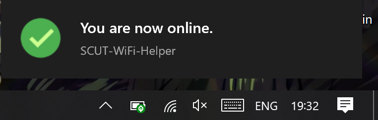

# SCUT Wifi Helper For Windows   
## 华南理工大学</br>宿舍WiFi连接助手

##	使用说明

命令行：
*	Python 3
*	Python 3 包：pywin32和requests
可以运行这个来确定是否已经安装：
>	pip install pywin32 requests  

有界面：  
*	**.Net Framework 4.6**  
*	**Windows 10 1709或更高**  


然后就可以用啦！


##	V0.3.1 Update:  
*	重构ConnectWiFi模块.  
####	2019/11/3 Update:  
*	**（新增：针对Win10的C#版本）**	使用右下角的Toast Notification作为UI.（需要Win10 1709或更高）
	
*	注意：使用ConnectWiFi_for_win10时，请在项目引用中引入
	```Windows.Foundation.UniversalApiContract```以启用```Windows.UI```和```Windows.Data```


##	V0.3.0 Update:
*	可以自动连接*scut-student*热点了
>	说明：仓库中添加的动态链接库是用来自动连接WiFi的；这些代码参考了MSDN的Native Wifi API样例，~~由于时间匆忙，写的也比较乱orz~~由于x86和x64的DLL不是兼容的，因此你可能在32位机子上需要把脚本中的"x64"改成"x86".仓库中附带了两份编译好的DLL，当然你也可以自己编译.  

##	V0.2.1 Update:
~~*	忽略认证页面的证书~~  
##	V0.2.0 Update:   
*	自动获取IP地址  
##	V0.1.0 Update:  
*	实现**记忆密码、自动认证**  


####	欢迎大家提issue  

